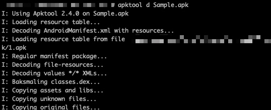
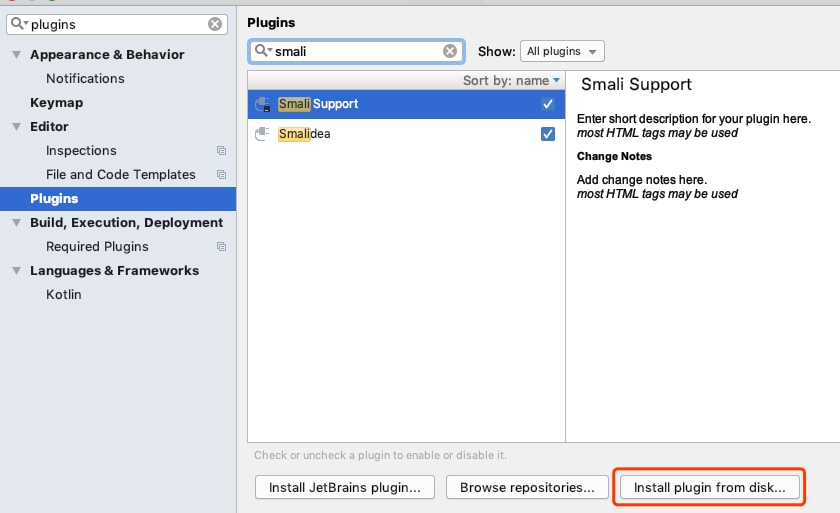
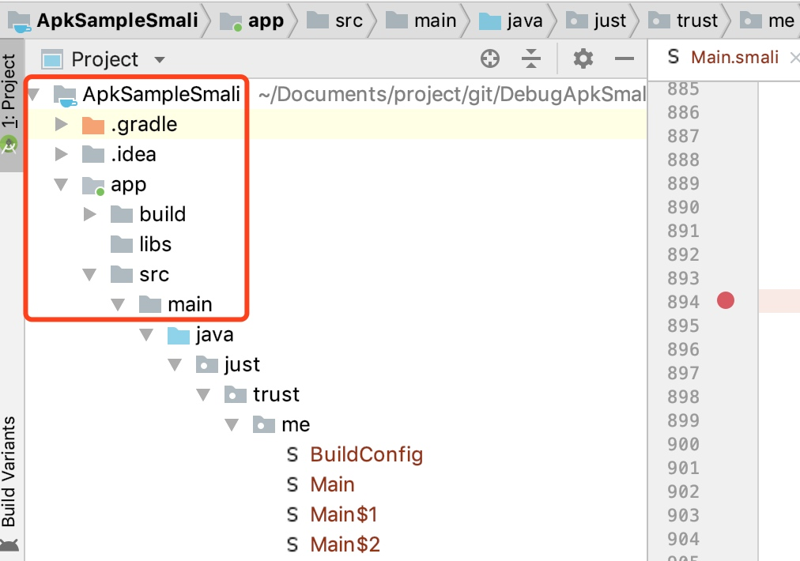
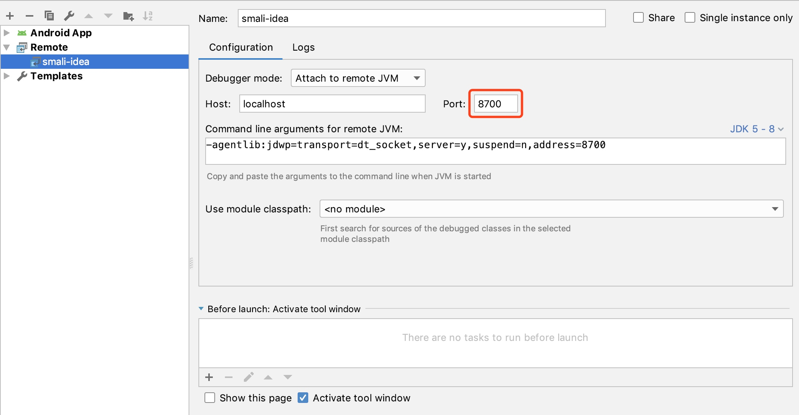
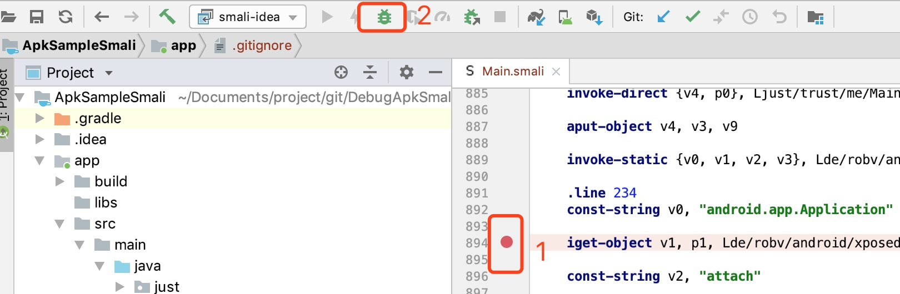

# 基于Smali文件 Android Studio 动态调试 APP

> 最近在研究动态调试技术，网上关于基于Smali动态调试App的教程很多，很多细节都没有贴出来，走了很多弯路，将调研结果分享一下，如果有写的不好地方，欢迎指正

### 准备工作

* 一部Root过的Android手机，打开开发者模式
* Xposed的运行的环境
* 安装smalidea插件，[点击这里下载](https://bitbucket.org/JesusFreke/smali/downloads/) 
* 安装BDOpener.apk或者XDebug.apk

### 反编译Apk(apktool)

点击[这里下载](https://bitbucket.org/iBotPeaches/apktool/downloads/)最新的apktool, 并配置好环境（不同环境配置的方式不同，参考[官网](https://ibotpeaches.github.io/Apktool/install/)）

下载你需要反编译的Apk文件，执行

```
apktool d 反编译Apk名字.apk
```



如果反编译出来多个smali文件夹，可以用ant写个脚本，多个文件夹合并成一个

### smalidea

AndroidStudio如果要调试smali代码，需要安装第三方插件: smalidea

AS中【Android Studio-->Preferences-->Plugins-->Install plugin from desk...】，安装插件



### AS导入smali

* 新疆一个Android工程项目（ps: 一定要新建Android项目，否则可能会找不到 “Attach debuger to Android Process”）

* 复制反编译好的smali文件, 到新建Android项目java文件夹下

PS: 也可以使用我配置好的项目 "ApkSampleSmali" 进行测试



### AS动态调试配置

新建调试配置，【Run-->Edit Configurations--> + -->Remote】，name随意，端口8700



### 动态调试

* 在smali代码中打入断点，如下图标记1

* 然后点击 “Attach debuger to Android Process” ，如下图标记2



### 运行环境信息

* Xposed Version90-beta3
* BDOpener 1.0
* AndoridStudio 3.3.2
* smalidea 0.0.5
* apktool 2.4.0

 

